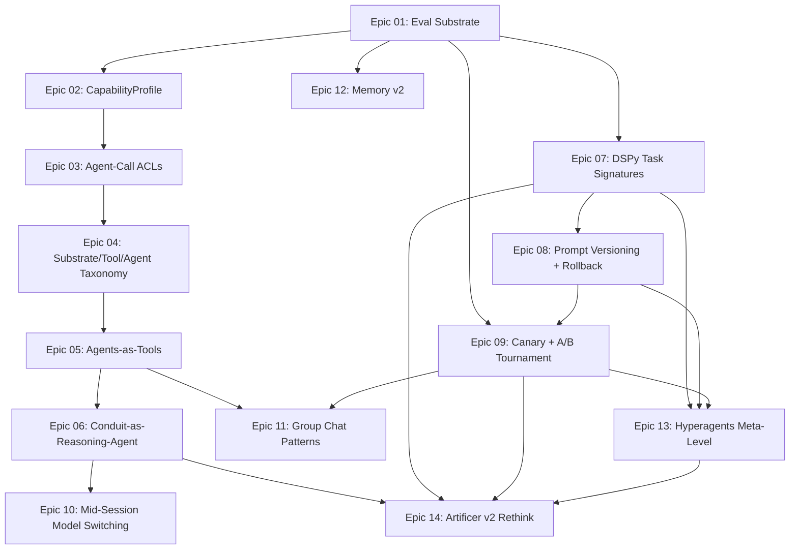

# Self-Improving Agent Harness — Spec Index

Spec-driven design for evolving Stronghold from a heuristic orchestrator into a
self-improving reasoning system. Each epic ships independently behind a feature
flag, with acceptance criteria mapped 1:1 to TDD test stubs.

## Dependency Graph

## Epic Index

| # | Epic | Status | Ship Gate |
|---|------|--------|-----------|
| 01 | [Eval Substrate](epic-01-eval-substrate/) | Draft | Behavioral tags emit on spans; one holdout split passes |
| 02 | [CapabilityProfile](epic-02-capability-profile/) | Draft | Profile round-trips for all shipped agents |
| 03 | [Agent-Call ACLs](epic-03-agent-call-acls/) | Draft | Sentinel blocks transitive escalation in test suite |
| 04 | [Substrate/Tool/Agent Taxonomy](epic-04-substrate-tool-agent-taxonomy/) | Draft | `kind: light` agent runs with zero tools in test harness |
| 05 | [Agents-as-Tools](epic-05-agents-as-tools/) | Draft | Agent calls another agent via tool interface with trace span |
| 06 | [Conduit-as-Reasoning-Agent](epic-06-conduit-reasoning-agent/) | Draft | Conduit reasoning loop replaces heuristic router on flag |
| 07 | [DSPy Task Signatures](epic-07-dspy-task-signatures/) | Draft | DSPy-compiled prompt outperforms hand-written on holdout |
| 08 | [Prompt Versioning + Rollback](epic-08-prompt-versioning-rollback/) | Draft | Rollback restores previous prompt and passes eval |
| 09 | [Canary + A/B Tournament](epic-09-canary-ab-tournament/) | Draft | Staged promotion gates on holdout before full rollout |
| 10 | [Mid-Session Model Switching](epic-10-midsession-model-switching/) | Draft | Model switches on cost/quality signal, conversation continues |
| 11 | [Group Chat Patterns](epic-11-group-chat-patterns/) | Draft | Scribe debate produces higher-rated output than single-pass |
| 12 | [Memory v2](epic-12-memory-v2/) | Draft | Agent self-edits memory via tool call; cache-hit rate tracked |
| 13 | [Hyperagents Meta-Level](epic-13-hyperagents-meta-level/) | Draft | DSPy optimizes Auditor rubric; meta circuit breaker tested |
| 14 | [Artificer v2 Rethink](epic-14-artificer-v2-rethink/) | Draft | V1 learnings captured; v2 design-freeze criteria documented |

## Cross-Cutting References

- [GLOSSARY.md](GLOSSARY.md) — shared vocabulary
- [CONVENTIONS.md](CONVENTIONS.md) — story template, test-path rules, feature-flag naming
- [SEQUENCING.md](SEQUENCING.md) — release-train rules and ordering rationale
- [EVIDENCE-INDEX.md](EVIDENCE-INDEX.md) — bibliography of external sources
- [OPEN-QUESTIONS.md](OPEN-QUESTIONS.md) — unresolved design questions
